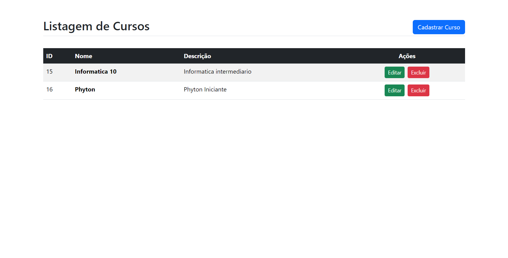
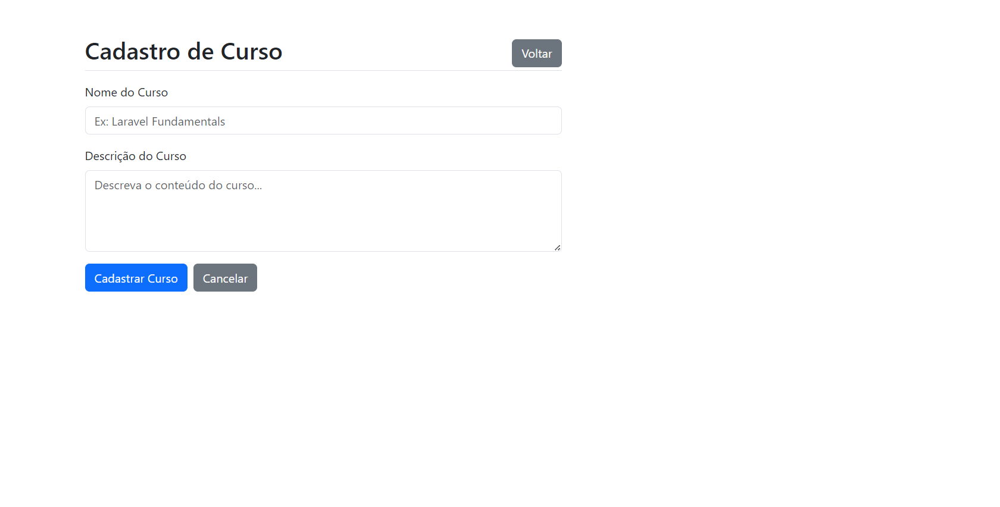
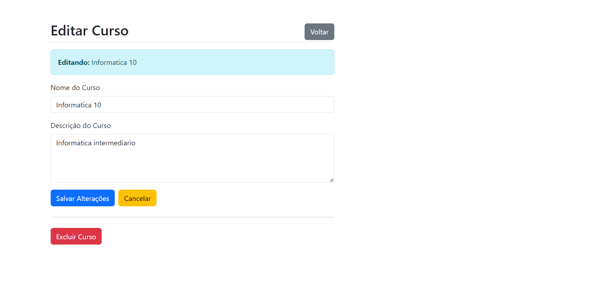
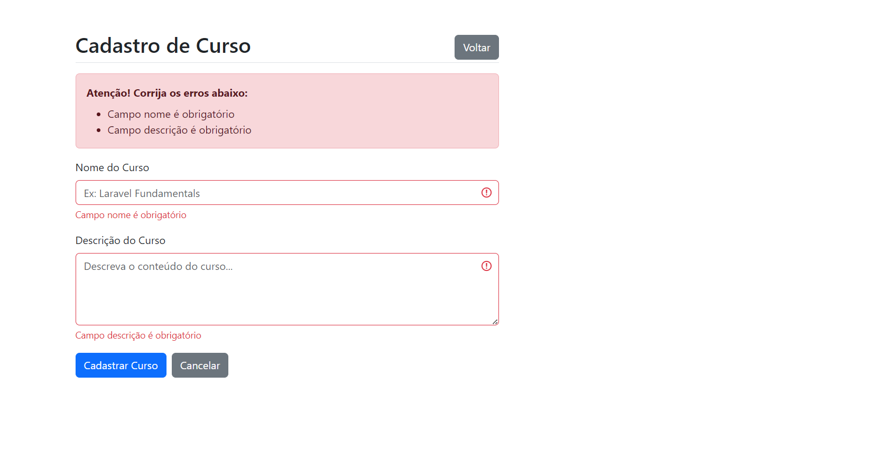
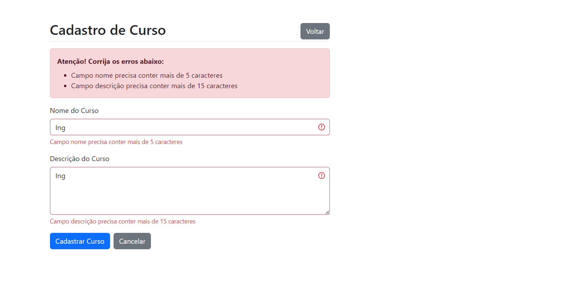

# 📚 Sistema CRUD de Cursos - Laravel

Sistema completo de gerenciamento de cursos desenvolvido com Laravel 11, demonstrando domínio de arquitetura MVC, validações, e interface responsiva com Bootstrap 5.


---

## 📋 Sobre o Projeto

Sistema web para gerenciamento de cursos com operações completas de CRUD (Create, Read, Update, Delete), desenvolvido como demonstração de habilidades em desenvolvimento full-stack com foco no framework Laravel.

### ✨ Funcionalidades

- ✅ **Listagem de Cursos** - Visualização de todos os cursos cadastrados em tabela responsiva
- ✅ **Cadastro de Cursos** - Formulário completo com validação de dados
- ✅ **Edição de Cursos** - Atualização de informações com validação
- ✅ **Exclusão de Cursos** - Remoção com confirmação de segurança
- ✅ **Validação de Formulários** - Validação server-side com mensagens customizadas
- ✅ **Feedback Visual** - Mensagens de sucesso e erro para o usuário
- ✅ **Interface Responsiva** - Compatível com desktop, tablet e mobile

---

## 🛠️ Tecnologias Utilizadas

### Backend
- **PHP** 8.2+
- **Laravel** 11.x
- **MySQL** 8.0
- **Composer** (gerenciamento de dependências)

### Frontend
- **HTML5** & **CSS3**
- **Bootstrap** 5.3.8
- **Blade Templates** (Laravel)
- **JavaScript** (validações e confirmações)

### Arquitetura & Padrões
- **MVC** (Model-View-Controller)
- **RESTful** (Resource Controllers)
- **Form Request Validation**
- **Eloquent ORM**
- **Database Migrations**

---

## 📦 Pré-requisitos

Antes de começar, certifique-se de ter instalado:

- [PHP](https://www.php.net/downloads) >= 8.2
- [Composer](https://getcomposer.org/)
- [MySQL](https://www.mysql.com/) ou [MariaDB](https://mariadb.org/)
- [Git](https://git-scm.com/)

---

## 🚀 Como Rodar o Projeto

### 1. Clone o repositório
```bash
git clone https://github.com/seu-usuario/crud-cursos-laravel.git
cd crud-cursos-laravel
```

### 2. Instale as dependências
```bash
composer install
```

### 3. Configure o ambiente
```bash
# Copie o arquivo de ambiente
cp .env.example .env

# Gere a chave da aplicação
php artisan key:generate
```

### 4. Configure o banco de dados

Edite o arquivo `.env` com suas credenciais:

```env
DB_CONNECTION=mysql
DB_HOST=127.0.0.1
DB_PORT=3306
DB_DATABASE=nome_do_banco
DB_USERNAME=seu_usuario
DB_PASSWORD=sua_senha
```

### 5. Crie o banco de dados

No MySQL:
```sql
CREATE DATABASE nome_do_banco CHARACTER SET utf8mb4 COLLATE utf8mb4_unicode_ci;
```

### 6. Execute as migrations
```bash
php artisan migrate
```

### 7. Inicie o servidor
```bash
php artisan serve
```

### 8. Acesse a aplicação
Abra seu navegador em: **http://localhost:8000**

---

## 📁 Estrutura do Projeto

```
crud-cursos-laravel/
├── app/
│   ├── Http/
│   │   ├── Controllers/
│   │   │   └── CursoController.php      # Controller principal
│   │   └── Requests/
│   │       └── CursoRequest.php         # Validações customizadas
│   └── Models/
│       └── Curso.php                     # Model Eloquent
├── database/
│   └── migrations/
│       └── 2025_xx_xx_create_cursos_table.php
├── resources/
│   └── views/
│       └── curso/
│           ├── index.blade.php           # Listagem
│           ├── create.blade.php          # Formulário de cadastro
│           └── update.blade.php          # Formulário de edição
└── routes/
    └── web.php                           # Rotas da aplicação
```

---

## 🎨 Capturas de Tela

### Listagem de Cursos


### Cadastro de Curso


### Edição de Curso


### Validação de Formulário



---

## 🔧 Funcionalidades Técnicas

### Validações Implementadas

**Campos obrigatórios:**
- Nome do curso (mínimo 5 caracteres)
- Descrição do curso (mínimo 15 caracteres)

**Mensagens customizadas em português**

### Rotas (Resource Routes)

```php
Route::resource('curso', CursoController::class);
```

Gera automaticamente:
- `GET /curso` - Listagem
- `GET /curso/create` - Formulário de cadastro
- `POST /curso` - Salvar novo curso
- `GET /curso/{id}/edit` - Formulário de edição
- `PUT /curso/{id}` - Atualizar curso
- `DELETE /curso/{id}` - Excluir curso

---

## 💡 Aprendizados e Boas Práticas

### Implementados neste projeto:

- ✅ **Form Request Validation** - Validações isoladas e reutilizáveis
- ✅ **Route Model Binding** - Injeção automática de modelos
- ✅ **Compact Helper** - Passagem limpa de dados para views
- ✅ **Eloquent ORM** - Manipulação elegante de dados
- ✅ **Blade Components** - Templates reutilizáveis
- ✅ **CSRF Protection** - Segurança contra ataques
- ✅ **Method Spoofing** - Suporte a PUT/DELETE
- ✅ **Try-Catch** - Tratamento de exceções
- ✅ **Flash Messages** - Feedback para o usuário
- ✅ **Old Input** - Persistência de dados em caso de erro

---

## 🧪 Testando a Aplicação

### Fluxo de Teste Completo:

1. **Listar cursos** → Acesse a página inicial
2. **Cadastrar curso** → Clique em "Cadastrar Curso"
3. **Testar validação** → Tente enviar formulário vazio
4. **Criar curso válido** → Preencha corretamente e envie
5. **Editar curso** → Clique em "Editar" na listagem
6. **Excluir curso** → Clique em "Excluir" e confirme

---

## 🐛 Possíveis Problemas e Soluções

### Erro: "SQLSTATE[HY000] [1045] Access denied"
**Solução:** Verifique as credenciais do banco no arquivo `.env`

### Erro: "Class 'Curso' not found"
**Solução:** Execute `composer dump-autoload`

### Erro: "No application encryption key"
**Solução:** Execute `php artisan key:generate`

### Porta 8000 já está em uso
**Solução:** Use outra porta: `php artisan serve --port=8001`

---

## 📚 Recursos de Aprendizado

- [Documentação Laravel](https://laravel.com/docs)
- [Bootstrap 5 Docs](https://getbootstrap.com/docs/5.3/)
- [PHP.net](https://www.php.net/manual/pt_BR/)
- [Laracasts](https://laracasts.com/) - Tutoriais em vídeo

---

## 🤝 Contribuindo

Contribuições são bem-vindas! Para contribuir:

1. Fork o projeto
2. Crie uma branch: `git checkout -b feature/nova-funcionalidade`
3. Commit suas mudanças: `git commit -m 'Adiciona nova funcionalidade'`
4. Push para a branch: `git push origin feature/nova-funcionalidade`
5. Abra um Pull Request

---

## 📝 Licença

Este projeto foi desenvolvido para fins educacionais e de portfólio.

---

## 👤 Autor

**Alan Borges**

- GitHub: [@alanborgesdev](https://github.com/alanborgesdev)
- LinkedIn: [linkedin.com/in/alanborgesdev](https://linkedin.com/in/alanborgesdev)

---

## 🎯 Sobre Este Projeto

Este projeto foi desenvolvido como demonstração de habilidades técnicas em:
- Desenvolvimento web full-stack
- Framework Laravel (PHP)
- Arquitetura MVC
- Boas práticas de programação
- Interface responsiva
- Validação de dados

Desenvolvido com 💙 por Alan Borges
